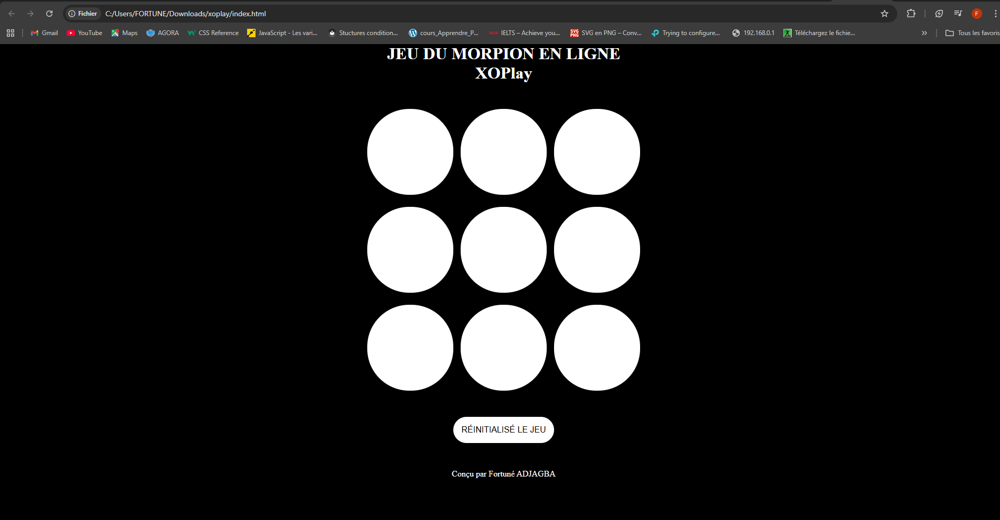
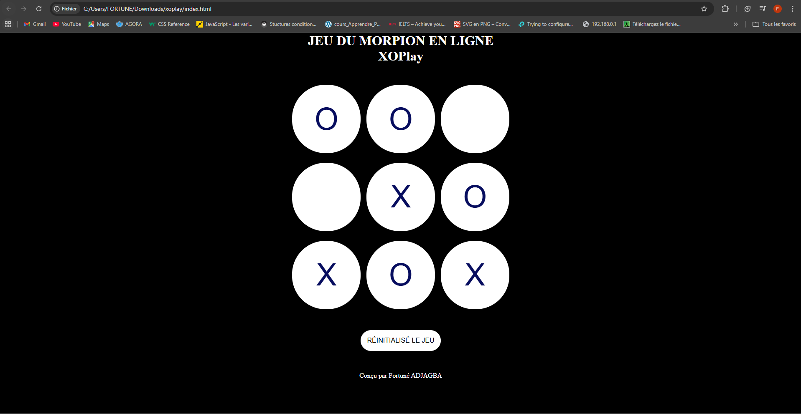
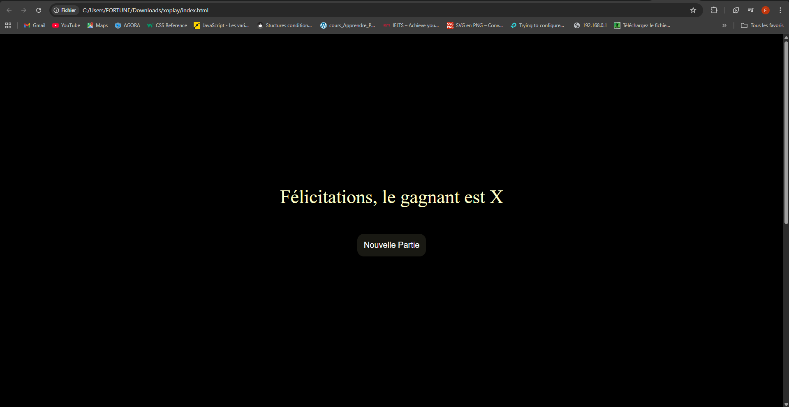
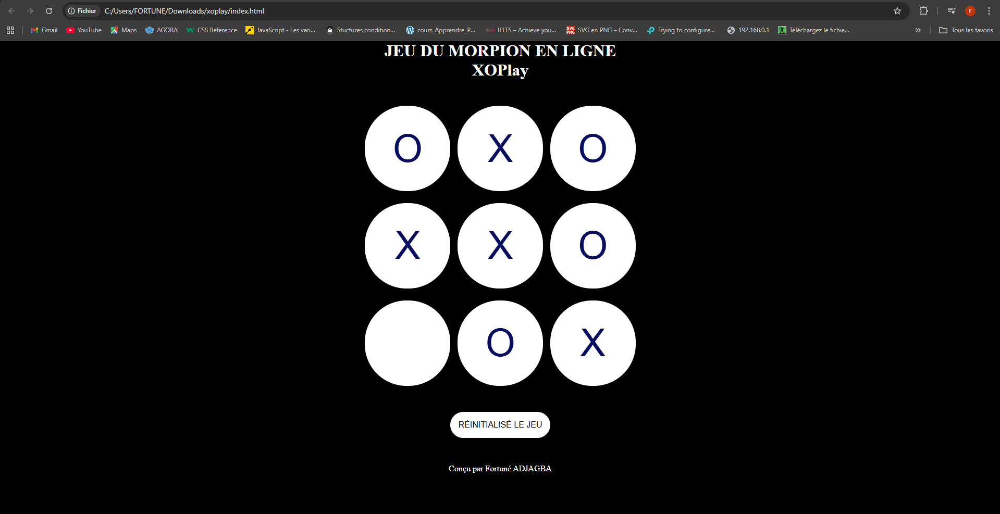
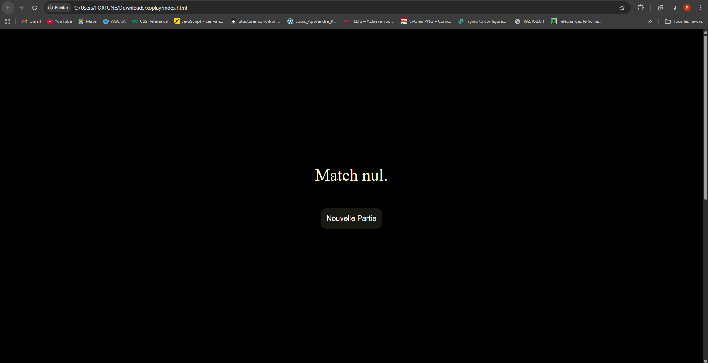

  
  
  
  
  

- index.html : Définit la structure HTML fondamentale de l'interface du jeu.. 
- styles.css : Styles CSS pour le plateau de jeu et le design réactif. 
- script.js : Gestion de la logique de base du jeu. Tours des joueurs, les conditions de victoire et le processus décisionnel de l'IA. 

## Démo en Direct

Vous pouvez consulter la démo en direct du jeu ici :

